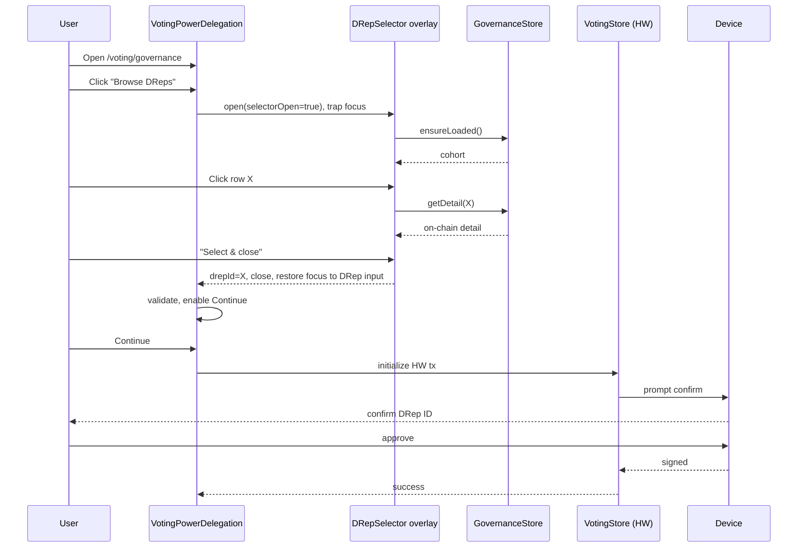

# Variant 2 — Embedded Selector Within Delegation

**Paradigm:** No new nav surface. From the existing `VotingPowerDelegation` form, a "Browse DReps" button opens a **full-screen overlay** that hosts directory + detail. Selecting a DRep closes the overlay and pre-fills the form. Favorites accessible via a tab inside the overlay.

## Information Architecture

```mermaid
flowchart TD
  Nav[Sidebar: Voting] --> Voting[/voting/governance]
  Voting --> Form[VotingPowerDelegation form]
  Form -- 'Browse DReps' --> Overlay[Overlay: DRep Selector]
  Overlay --> OvDir[Directory tab]
  Overlay --> OvFavs[Favorites tab]
  OvDir -- click row --> OvDet[Detail panel within overlay]
  OvDet -- 'Select' --> Close[Close overlay, pre-fill form]
  Close --> Form
  Form --> Confirm[Confirmation dialog]
```

No new routes. Overlay state lives in `GovernanceStore` and is opened by a `selectorOpen` flag set from the voting form container.

## Wireframes

### Voting form, current state, with new "Browse DReps" affordance

```
┌─ Voting > Cardano governance ────────────────────────────────┐
│  Wallet:    [▾ Wallet name]                                  │
│  Vote type: ( ) Abstain   ( ) No confidence   (●) DRep       │
│  DRep ID:   [drep1yg7s…aj8ras            ] [📂 Browse DReps] │
│             Invalid DRep ID? — search the in-app directory   │
│  [Continue]                                                  │
└──────────────────────────────────────────────────────────────┘
```

Message IDs introduced by V2 (see `shared-design-tokens.md` §9 → Variant-specific extras): `governance.voting.browseDReps`, `governance.drepSelector.selectAndClose`, `governance.drepSelector.cancel`, `governance.drepSelector.escHint`.

### Overlay (covers main content area, sidebar still visible for orientation)

```
╔══ Browse DReps                                            ✕ ══╗
║  [Directory] [Favorites (12)]                                  ║
║  ──────────────────────────────────────────────────────────── ║
║  [🔄 Refresh] Last updated 3 min ago                          ║
║  ⓘ Randomized cohort banner (same as V1)                      ║
║  [Search…]  [Filters ▾ (1)]                                   ║
║  ┌─ split into 60/40 list+detail when DRep highlighted ─────┐ ║
║  │ ☆ ● Active  drep1yg7s…aj8ras  ₳ 688K  >  │ Detail pane │ ║
║  │ ☆ ● Active  drep1ytfn…af3n5y  ₳ 23M    │ for selected │ ║
║  │ ☆ ⚠ Expiring drep1y2t3…wgyv7 ₳ 2.3M    │ row.        │ ║
║  │ …                                       │  [Select →] │ ║
║  └────────────────────────────────────────┴─────────────┘ ║
║  [Cancel]                                  [Select & close] ║
╚════════════════════════════════════════════════════════════════╝
```

When no row highlighted, list takes full overlay width; detail pane appears the moment a row is clicked.

### Compact detail-pane field subset

The overlay's right-hand detail pane is **deliberately truncated** vs the full V1/V3 detail surface to fit a 40%-width column without scroll. Sprint 2 fields rendered in the compact pane:

| Field | Compact pane (V2) | Full detail (V1/V3) |
|---|:---:|:---:|
| DRep ID (CIP-129 + CIP-105) | ✓ | ✓ |
| Status badge | ✓ | ✓ |
| Expires in {n} epochs | ✓ | ✓ |
| Voting power (rounded `₳`) | ✓ | ✓ |
| Voting power (exact ADA + raw lovelace) | — | ✓ |
| Anchor presence (URL/hash exists) | ✓ | ✓ |
| Registration epoch | — | ✓ |
| Current epoch vote tally | — | ✓ |
| Anchor URL (raw, displayed in full) | — | ✓ |
| Anchor digest (raw, copy button) | — | ✓ |
| Sprint 4 verified anchor content (givenName, objectives, references, paymentAddress, etc.) | — (deferred — see Sprint 4 Migration Path) | ✓ |

Truncated fields are accessible only by following the (Sprint 4) link to a full detail surface; in Sprint 2 there is no such link because there is no detail route — see the migration-path subsection at the end of this document.

## Interaction Sequence (HW Wallet Happy Path)



## Component Hierarchy

```
components/voting/voting-governance/
  VotingPowerDelegation.tsx                ← existing, add "Browse DReps" button
  drep-selector/
    DRepSelectorOverlay.tsx                ← top-level, react-polymorph Modal (full-screen variant)
    DRepSelectorOverlay.scss
    DRepSelectorTabs.tsx                   ← Directory | Favorites
    DRepSelectorList.tsx                   ← list/table reused inside overlay
    DRepSelectorDetailPane.tsx             ← compact detail (no full-page anchor section)
    DRepCard.tsx                           ← shared with V1/V3 ideally; defined here for V2 doc
    DRepStatusBadge.tsx
    DRepSourceLabel.tsx
    DRepIdDisplay.tsx
    DRepRefreshIndicator.tsx
```

No new layout container. Existing voting layout owns the route.

## State Treatments

Same matrix as V1 (`shared-design-tokens.md` §6) — only difference: empty/error states render **inside** the overlay; closing the overlay always returns the user to the form unchanged.

Edge case: if the overlay is open and the user clicks Refresh, it must not reset the highlighted DRep selection. The detail pane shows a per-pane spinner during the in-flight refresh.

## Anchor Source-Labelling Treatment

Same labels as V1. The overlay's compact detail pane shows the **anchor presence** badge but defers the full anchor-content render to Sprint 4. In Sprint 4 the compact pane gains a small `Verified` block (givenName + 1-line objective) with a "View full profile" link that opens detail in a new route — except this variant has **no detail route**, so Sprint 4 must add one (`/voting/governance/drep/:drepId`) or expand the overlay's detail pane to a full-page mode. **Risk flagged.**

## Default-Cohort UX

Banner identical to V1, sized to overlay width. "Show all" stays a toggle inside the overlay.

## Filter / Search Without Re-introducing Bias

Same as V1. Sort options become available only when "Show all" is active.

## Hardware Wallet Confirmation

Overlay must be fully closed before the HW confirmation dialog opens. Focus moves: overlay close → DRep input on form → Continue button → modal HW dialog (focus trap). This is critical for screen-reader and keyboard users — a stacked overlay + HW dialog confuses both react-polymorph's focus skin and Electron-native dialog ordering.

### Acceptance Criteria (V2-specific)

These are binding acceptance criteria for V2 implementation; they exist because the modal-on-modal pattern is fragile and easy to regress without explicit guards.

- **AC-V2-1 — Overlay fully unmounts before HW modal mounts.** The HW confirmation dialog must not mount while the selector overlay component (or its react-polymorph Modal skin) is still in the DOM. Implementation: await overlay unmount (or a single render tick after `selectorOpen=false`) before triggering `VotingStore.initializeHwTx`. e2e test asserts there is no point at which both `data-testid="drep-selector-overlay"` and `data-testid="hw-confirm-dialog"` are simultaneously present.
- **AC-V2-2 — Focus restores to the DRep ID input on overlay close.** After the overlay closes (whether via "Select & close", "Cancel", or Escape), document focus must be on the `DRep ID` input on the underlying voting form, not on `document.body` and not on the "Browse DReps" button. Asserted via `expect(document.activeElement).toHaveAttribute('name', 'drepId')`.
- **AC-V2-3 — Form submit disabled while `selectorOpen` is true.** The `Continue` button on `VotingPowerDelegation` must be `disabled` for the entire duration the overlay is open. This prevents a race where the user can submit before the selector hands off its `drepId`.
- **AC-V2-4 — End-to-end focus-traced scenario.** A Cucumber e2e scenario covers the full sequence: open form → click "Browse DReps" → overlay opens (focus inside overlay) → select a DRep → "Select & close" → overlay unmounts (focus on DRep ID input, form pre-filled, `Continue` re-enabled) → click `Continue` → HW confirmation modal mounts (focus on first focusable element of HW modal). Focus assertions at each of the five transitions.

## Sprint 4 Migration Path

V2 ships Sprint 2 cheapest, but it pays a debt in Sprint 4 because verified anchor content (CIP-119 `givenName`, `image`, `objectives` up to 1000 chars, `references`, `paymentAddress`) does not fit in the overlay's compact detail pane. Two migration options exist, and **selecting V2 commits to executing one of them in Sprint 4**:

| Option | What it adds | Pros | Cons |
|---|---|---|---|
| **A. New detail route** | Add `/voting/governance/drep/:drepId` (or `/governance/dreps/:drepId`) as a real route. Overlay "View full profile" link navigates to it. | Deep-linkable, supports docs/changelog references, accessibility-clean, scales to future surfaces. | Re-introduces nav-surface work V2 was chosen to avoid; effectively converges V2 → V3 by Sprint 4. |
| **B. Full-page overlay mode** | Overlay grows a second "expanded" mode that takes 100% of the main area and reveals the full anchor content inline (no new route). | No new route; preserves V2's nav stance. | No deep link; focus management gets harder; modal-in-modal pattern grows; future governance surfaces still need real routes. |

Recommendation if V2 is selected: pre-commit to **Option A** in the Sprint 4 design pass, and budget the Sprint 4 cost accordingly (~6–10h delta vs V1/V3, per the cost table below). Document this commitment in the README comparison matrix.

## Accessibility

- Overlay implemented as a true modal (`role="dialog"`, `aria-modal="true"`, focus trap, restore-focus on close).
- Escape key closes the overlay; user is informed via "Press Esc to cancel" footer hint.
- Tab cycles within: tabs → search → filter → list → detail pane → cancel/select buttons.
- When list has a highlighted row but no detail loaded yet, the detail pane announces `"Loading DRep detail…"` via `aria-live="polite"`.
- The 60/40 split must reflow to stacked (list above, detail below) at narrow window widths (Daedalus has resizable windows down to ~1024px).

## Pros / Cons / Risks

**Pros**
- Smallest nav-surface change. Existing users find DRep browsing exactly where they already delegate.
- Smallest Sprint 2 cost — single new component tree, no route plumbing.
- Form state is preserved across browsing (wallet selection, vote type) without route round-tripping.

**Cons**
- Discoverability suffers: users who don't already know to open the voting form will not find the directory. No deep-linkable URL.
- Anchor-rich detail in Sprint 4 is awkward in a modal — likely forces a follow-up redesign.
- Modal + HW-wallet dialog stacking is a known fragility area in Electron renderers; needs explicit focus-restoration tests.

**Risks**
- Without a detail route, support docs and changelog cannot link directly to a DRep view.
- Future expansion to proposals/dashboard cannot live inside this overlay; an IA migration is inevitable, just deferred.
- Existing voting form already has fairly long content; "Browse DReps" button must not push primary CTA below the fold on the minimum supported window height.

## Implementation Effort Delta vs Sprint 2 Baseline

| Δ | Reason |
|---|---|
| −3 to −5h | No new top-level nav, no new routes |
| +2h | Modal focus-management correctness work + tests |
| +1h | Form integration (button + state plumbing) |
| **Total ~−1 to −3h vs baseline** (cheapest variant) | |

Caveat: Sprint 4 anchor work likely costs 6–10h more than V1/V3 because the overlay must either grow or spawn a route.
