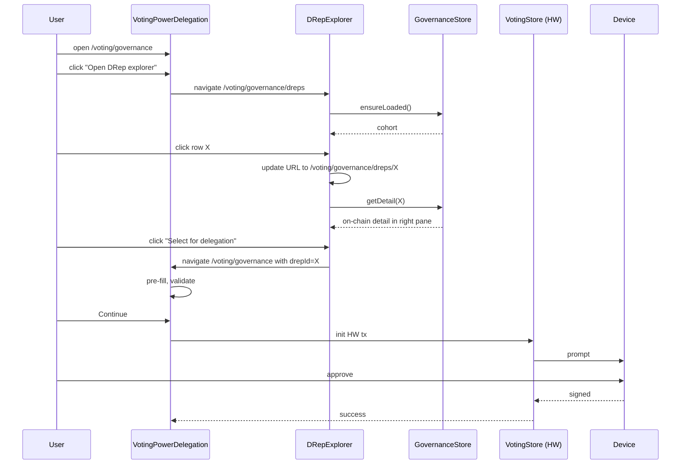

# Variant 3 — Split-Pane Explorer

**Paradigm:** A single route renders directory list + detail pane side-by-side, with a persistent filter rail on the left. Selecting a row populates the right pane; selecting a DRep for delegation routes back to the voting form with pre-fill.

## Information Architecture

```mermaid
flowchart TD
  Nav[Sidebar: Voting] --> Voting[/voting/governance]
  Voting --> Form[VotingPowerDelegation form]
  Form -- 'Open DRep explorer' --> Expl[/voting/governance/dreps]
  Expl --> Pane[Split-pane: filters | list | detail]
  Pane -- 'Select for delegation' --> Hand[Return to form with drepId]
  Hand --> Form
  Form --> Confirm[Confirmation]
```

New route (single):

```
VOTING.GOVERNANCE_DREPS: '/voting/governance/dreps'
VOTING.GOVERNANCE_DREP_DETAIL: '/voting/governance/dreps/:drepId'
```

The selected DRep is encoded as a path parameter (chosen: **Option A — path param**, for deep-link clarity and consistency with Daedalus's existing detail routes such as `/wallets/:walletId`). `:drepId` is optional in the sense that `/voting/governance/dreps` renders the explorer with no row highlighted; activating a row pushes/replaces history to `/voting/governance/dreps/:drepId`.

Message IDs introduced by V3 (see `shared-design-tokens.md` §9): `governance.voting.openExplorer`, `governance.drepExplorer.backToForm`, `governance.drepDirectory.backToDirectory`.

### Existing-codebase fit

Daedalus's current `source/renderer/app/containers/voting/Voting.tsx` decides which sidebar nav item is active via **exact route equality** against `VOTING.GOVERNANCE`. V3 introduces two descendant routes (`/voting/governance/dreps` and `/voting/governance/dreps/:drepId`) that should *also* keep the "Voting" sidebar item active — otherwise the user appears to be in no nav section while browsing the explorer, which is a known Daedalus regression mode.

**Sprint 2 prerequisite (binding):** Update the sidebar active-item matcher in `containers/voting/Voting.tsx` (and any analogous matcher in the sidebar component) from exact-equality to **prefix / descendant matching** for the Voting category, so any path starting with `/voting/governance` activates the Voting sidebar item. Add a unit test asserting `/voting/governance/dreps/<id>` activates Voting. This work blocks the V3 implementation tasks and must be scheduled in Sprint 2 before route wiring.

## Wireframes

```
┌─ Voting > Cardano governance > DRep explorer ─────────────────────────────┐
│ [← Back to delegation form]   [🔄 Refresh] Last updated 3 min ago         │
│ ┌─ Filters ──────┬─ DReps (187 in cohort) ────┬─ Detail ─────────────────┐│
│ │ Status         │ [Search…]                  │ drep1yg7s…aj8ras    📋  ││
│ │ ☑ Active       │ ⓘ Randomized cohort banner │ (CIP-105) drep185r…📋   ││
│ │ ☐ Inactive     │ ────────────────────────── │                          ││
│ │ ☐ Retired      │ ☆ ● drep1yg7s…aj8ras       │ On-chain                 ││
│ │                │   ₳ 688K                   │ ● Active                 ││
│ │ Metadata       │ ☆ ● drep1ytfn…af3n5y       │ Expires in 34 epochs     ││
│ │ ☐ Has anchor   │   ₳ 23M                    │ Voting power ₳ 688,964   ││
│ │ ☐ Verified*    │ ☆ ⚠ drep1y2t3…wgyv7        │ (688,964,123,456 lov.)   ││
│ │                │   ₳ 2.3M                   │ Current votes: 2 Yes ·   ││
│ │                │                            │   1 No · 0 Abstain       ││
│ │                │                            │   (this epoch)           ││
│ │                │                            │                          ││
│ │ Cohort         │ …                          │ Anchor                   ││
│ │ ☐ Show all     │                            │ URL present              ││
│ │ ☐ Favorites    │                            │ Unverified anchor        ││
│ │                │                            │                          ││
│ │ [Reshuffle]    │ ◀ page 1 of 8 ▶           │ ☆ Favorite               ││
│ │                │                            │ [Select for delegation]  ││
│ └────────────────┴────────────────────────────┴──────────────────────────┘│
└───────────────────────────────────────────────────────────────────────────┘
```

\* Verified filter only meaningful in Sprint 4.

## Interaction Sequence (HW Wallet Happy Path)



## Component Hierarchy

```
components/voting/voting-governance/
  VotingPowerDelegation.tsx               ← add "Open DRep explorer" link
  drep-explorer/
    DRepExplorer.tsx                       ← page container, owns split-pane layout
    DRepExplorer.scss
    DRepExplorerFilterRail.tsx
    DRepExplorerList.tsx
    DRepExplorerListRow.tsx                ← compact row optimized for narrow column
    DRepExplorerDetailPane.tsx
    DRepExplorerHeader.tsx                 ← back link + refresh + last-updated
    DRepStatusBadge.tsx                    ← shared tokens §1
    DRepSourceLabel.tsx                    ← shared tokens §2
    DRepIdDisplay.tsx
    DRepRefreshIndicator.tsx
    DRepEmptyState.tsx
    DRepErrorBanner.tsx
```

Favorites are surfaced as a filter facet ("Cohort > Favorites"), not a separate page — minimizing surface area while keeping them reachable.

## State Treatments

Same matrix as V1. Specific to V3:

- **No row highlighted yet**: detail pane shows an instructional empty state ("Select a DRep on the left to see details") — never blank.
- **Detail load failed**: detail pane shows inline error with retry; list remains interactive.
- **Filter rail collapsed at narrow width**: rail becomes a `Filters ▾` button above the list.

## Anchor Source-Labelling Treatment

Identical to V1. The detail pane is full-feature (not compact like V2), so Sprint 4 enrichment slots in cleanly without a route migration.

## Default-Cohort UX

Banner above the list column (not over the whole page) so it remains contextual to the list pane. Filter rail's `Cohort > Show all` toggle plus a `Reshuffle` button at the bottom of the rail.

## Filter / Search Without Re-introducing Bias

Identical to V1. Sort options gated behind `Show all`.

**Popularity-sort guardrail.** When the user activates `voting power desc` sort under Show-all, the explorer shows the same inline disclosure as V1 directly above the list column (message ID `governance.drepDirectory.showAll.sortBiasWarning`):

> "Sorted by voting power. Default randomized order is designed to reduce popularity bias — consider returning to default for unbiased browsing."

## Hardware Wallet Confirmation

Identical inheritance from `VotingPowerDelegation` HW path, including the identity-equality rule in shared tokens §7 (the on-device DRep ID must be byte-equal to the confirmation dialog ID and to the signed payload `vote.id`). On return-to-form navigation, the explorer state is preserved in `GovernanceStore` so a "Back to explorer" link from the form post-success returns the user to exactly the same row/detail/scroll position.

## Accessibility

- Three-pane layout exposed as three `<section aria-label="…">` regions.
- Keyboard order: filter rail → search → list → detail pane → primary actions. The `/` key (standard app-level search shortcut, consistent with browsers and most explorer-style apps) focuses the search input; the per-page keyboard help line must document this shortcut.
- Arrow keys within the list move row highlight and update URL/detail (debounced ~150ms to avoid query thrash). `Enter` does not navigate away — only `Select for delegation` does.
- Filter rail toggles announce state change via `aria-live`.
- Detail pane updates announce "Showing details for {DRep ID}" on row change.
- The split-pane minimum widths must accommodate long German/Japanese labels (e.g., Status badges and column headers). Filter rail uses a 240px floor; below 1100px window width the rail collapses.

## Pros / Cons / Risks

**Pros**
- Fastest evaluate-then-delegate flow: no overlay open/close, no route hops between list and detail.
- Filter rail is permanently visible → encourages users to apply filters before scanning, reducing cognitive load.
- Sprint 4 anchor content lives naturally in the detail pane.

**Cons**
- Narrow detail pane challenges long anchor content (CIP-119 `objectives` up to 1000 chars).
- Three-pane layout is constrained on smaller window widths; reflow logic is non-trivial.
- Mid-tier discoverability: nested under Voting, but at least URL-addressable.

**Risks**
- Reflow at <1100px window width must be tested manually for both themes — Daedalus doesn't currently have responsive tests.
- The "list ↔ URL" sync (arrow keys updating `:drepId`) introduces history-stack pollution unless using `history.replace` for in-pane navigation.
- Anchor verification UI (Sprint 4) may overflow the detail column → need a scoped scroll container without losing the right-pane action footer.

## Implementation Effort Delta vs Sprint 2 Baseline

| Δ | Reason |
|---|---|
| +3–5h | Split-pane layout + reflow logic + tests |
| +2–3h | URL-sync for `:drepId` with `history.replace` semantics |
| +1–2h | Filter rail facets (more facets than V1/V2 to compensate for no separate Favorites page) |
| 0h | No new top-level nav, no new layout container |
| **Total ~+6–10h on top of baseline** | |
